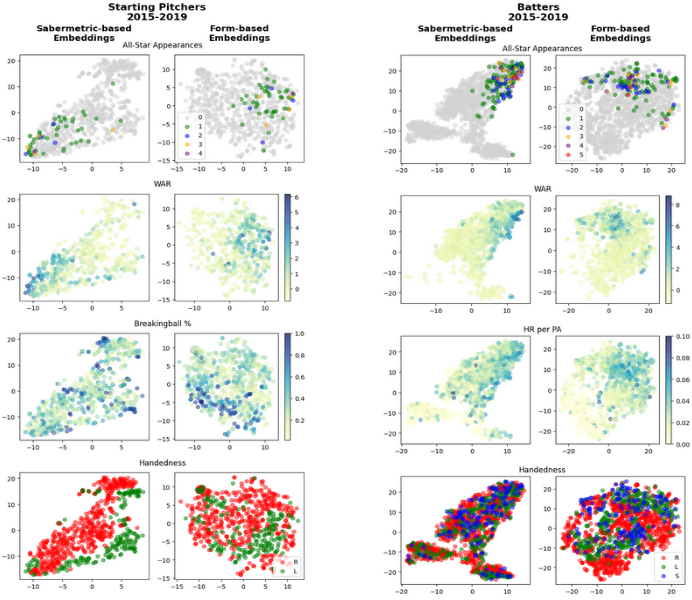
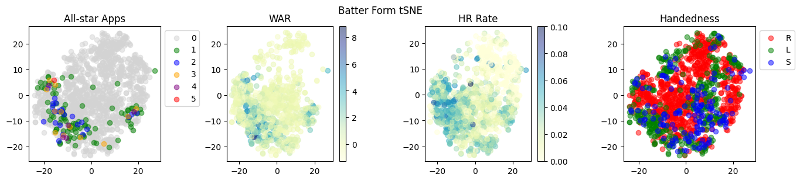

# Learning to Describe How Players Impact the Game in the MLB
This repository contains the elements necessary to describe how players in the MLB impact the game over the short term,
which we colloquially refer to as their _form_. Concretely, player _form_ is described by a numerical vector derived 
from the sequence of in-game events in which the player participated. The steps described below will guide you through
the process from start to finish - collecting the data, training the model, describing player _form_, and visualizing 
the produced _form_ embeddings. We present a small comparison of _form-_ vs _statistic-_ based embedding visualizations 
below. A more complete set of batter visualizations can be found [here](figures/batter_form_plots.png) and pitcher
visualizations [here](figures/pitcher_form_plots.png) (these more complete visualizations will also be created in step
5 below).



In general, we find that both _form-_ and _statistic-_ based embeddings do a good job of differentiating the "good"
players form the "bad" ones, but that the _form-_ based embeddings are better suited for highlighting the manner in
which the "good" players impact the game. For a succinct example of this, we look to the starting pitcher
visualizations. We see that both the _form-_ and _statistic-_ based embedding visualizations seem to generally induce a
region of all-star players. When looking to breaking ball usage, however, we see no association in the _statistic-_
based visualizations, but a clear grouping of pitchers who throw a large portion of breaking balls in the _form-_ based
visualizations.

# Implementing Pipeline

**Before proceeding, please install all packages listed in requirements.txt**

1. Fetching data
2. Preparing training data
3. Training player _form_ models
4. Describing player _form_
5. Visualizing _form_ embeddings
6. Clustering _form_ embeddings
7. Predicting Game Winner

**NOTE:** While we provide the code to construct a local database and use it to create at-bat records to train and use
the models below, the constructed database, at-bat records, _form_ vectors, and _form_ clusters can be found [here](https://pennstateoffice365-my.sharepoint.com/:f:/g/personal/czh5372_psu_edu/Eujd0Rhrf5dKgOyJgKyy8T8BS5lsZqEeecSoXTYXleXCIQ?e=CPOfRg).
The at-bat records are grouped by season and compressed (i.e. `201*.tar.gz`). To extract the data for 2015, for example,
execute `tar -xzf 2015.tar.gz` command. The database can found in the `mlb.db.tar.gz` file and extracted using the
`tar -xzf mlb.db.tar.gz` command.

To use the pre-constructed database, create a `database/` directory at the root-level of the repo and place the 
decompressed `mlb.db` database in that directory. If using the pre-constructed database, step 1 below can be skipped.

To use the pre-constructed at-bat records, create a `data/ab_seqs/ab_seqs_v1` directory at the root level of the repo
and place the decompressed at-bat records grouped by season in that directory. That is, `data/ab_seqs/ab_seqs_v1` should
have five sub-directories - `2015`, `2016`, `2017`, `2018`, and `2019` - each containing at-bat records for that season. 
If using the pre-constructed at-bat records, step 2 below can be skipped.

To use the pre-computed player _form_ vectors, create an `out/forms` directory at the root level of the repo. Then, 
download `batter_form_v1.tar.gz` and `pitcher_form_v1.tar.gz` from the link given above, place them in the `out/forms`
directory, and extract them. After doing so, you should have two new directories: `out/forms/batter_form_v1` and 
`out/forms/pitcher_form_v1`. If using pre-computed player _form_ vectors, step 4 below can be skipped.

To use the pre-computed _form_ clusters, create an `out/form_cluster` directory at the root level of the repo. Then,
download the `batter1_agglom.tar.gz` and `pitcher1_agglom.tar.gz` files from the link provided above, place them in the
`out/form_cluster` directory, and extract their contents. You should have two new directories: 
`out/form_cluster/batter1_agglom` and `out/form_cluster/pitcher1_agglom`. If using pre-computed _form_ clusters, you can
comment out the first phase of the `cluster_player_forms_and_plot.sh` script in step 6.

# 1. Fetching Data
**Estimated duration:** 10-15 minutes

To fetch data, simply run the [`fetch_data.sh`](fetch_data.sh) script (also given below).
By default, this will collect pitch-by-pitch statcast data for 2015-2019, and seasonal statistics back to 1995.
The script will create a `database` directory and create a database file at `database/mlb.db`. To change where the
database is placed, change the `DB_FP` variable in the `fetch_data.sh` script to the desired location. If you change the
location of the database, please make note of it as you will need it later.

The script utilized two custom "worker" classes, a PyBaseball worker and a SQLWorker.
The PyBaseball workers fetch data via the [PyBaseball](https://github.com/jldbc/pybaseball) library and then pass it to 
an SQLWorker to populate a local database. Pitch-by-pitch data will be collected first, followed by the season-by-season
stats. In total, there will be around 3.6M pitch-by-pitch records, 2k season-by-season pitching records, and 3.7k
season-by-season batting records.
The workers will periodically print their status, ie how many records have been processed and the current date range
being processed. Should only take 10-15 minutes on a modern CPU w/ solid-state storage.

**fetch_data.sh:**
```shell
#!/bin/bash

export DB_FP="$PWD/database/mlb.db"

# move to source dir
cd src

echo "******************************"
echo "* Fetching play-by-play data *"
echo "******************************"
python3 fetch_data.py --statcast T --pitching_by_season F --batting_by_season F \
                      --start_year 2015 --end_year 2019 \
                      --n_pybaseball_workers 3 --database_fp $DB_FP

echo "**********************************"
echo "* Fetching season-by-season data *"
echo "**********************************"
python3 fetch_data.py --statcast F --pitching_by_season T --batting_by_season T \
                      --start_year 1995 --end_year 2019 \
                      --n_pybaseball_workers 1 --database_fp $DB_FP
```

# 2. Preparing Training Data
**Estimated duration:** 65 minutes

The first step in creating the training data is to make a single record for each plate appearance in the newly 
constructed database. To do so, simply run the [`construct_at_bat_records.sh`](construct_at_bat_records.sh) script (also
given below). If you created the database in a location other than `database/mlb.db` (i.e. you changed `DB_FP` in the 
`fetch_data.sh` script), please update that for this script as well. By default, running the script will create a 
`data/` directory in the repo, and the individual at-bat records will be placed in the `data/ab_seqs/ab_seqs_v1/` 
directory, grouped by season. The output location can be adjusted by modifying the `AB_OUT_DIR` variable in the script.

In a system with a modern CPU and solid-state storage, it will take roughly 4.5 seconds to construct the at-bats for an
individual game. By default, the script will try to utilize 4 threads to construct the records. This can be adjusted
by changing the value of the `N_WORKERS` variable in the `construct_at_bat_records.sh` script. When 16 threads are used,
it will take roughly 1 hour for the script to complete processing. Records for each season will take up about 10.5 GB,
so for all five seasons, so ~55 GB of free space is required.

Once the at-bat records are constructed, the script will begin to aggregate at-bat records by player in chronological
order. First pitchers, then batters. This should only take about a minute or less. By default, the script will create a
`data/player_career_data` directory in the repo and place the output within. If you wish to change the location of the
output, simply change the `CAREER_OUT_DIR` variable in the script.

Finally, the script will create whole game records that will be used later on. That is, records describing individual 
games in terms of the starting batters, pitchers, location, score, and hits among others. By default, the records will
be placed in the `data/whole_game_records/by_season` directory in the repo. This phase should only take around five 
minutes.

**construct_at_bat_records.sh:**
```shell
#!/bin/bash

export AB_OUT_DIR="$PWD/data/ab_seqs/ab_seqs_v1"
export CAREER_OUT_DIR="$PWD/data/player_career_data"
export WHOLE_GAME_OUT_DIR="$PWD/data/whole_game_records/by_season"

export DB_FP="$PWD/database/mlb.db"
export N_WORKERS=16

# move to source dir
cd src

echo "***************************"
echo "* Building at-bat records *"
echo "***************************"
python3 construct_at_bat_records.py --start_year 2015 --end_year 2019 --n_workers $N_WORKERS \
                                    --out "$AB_OUT_DIR" --db_fp "$DB_FP"

echo "********************************"
echo "* Building pitcher career data *"
echo "********************************"
python3 construct_player_career_records.py --player_type "pitcher" --db_fp "$DB_FP" \
                                           --outdir "$CAREER_OUT_DIR"

echo "*******************************"
echo "* Building batter career data *"
echo "*******************************"
python3 construct_player_career_records.py --player_type "batter" --db_fp "$DB_FP" \
                                           --outdir "$CAREER_OUT_DIR"

echo "*******************************"
echo "* Creating whole game records *"
echo "*******************************"
python3 create_whole_game_records.py --data "$AB_OUT_DIR" --out "$WHOLE_GAME_OUT_DIR"
```

# 3. Training Player _Form_ Models
**Estimated duration:** 2.5 days (pitchers), 3 days (batters)

**NOTE:** Before proceeding with this step, please unsure you have a CUDA capable GPU and CUDA installed on the machine
you intend to run the models on. Additional information to this end can be found
[here](https://pytorch.org/get-started/locally/). While you can _technically_ train these models on a CPU, it would take
an egregious amount of time to complete.

**NOTE:** GPUs with a minimum **32 GB** of RAM are required to _train_ the batter and pitcher models referenced in our
corresponding paper (defaults in training scripts). One GPU was used to train the batter model, while two GPUs were
used to train the pitcher model.

We provide scripts to train both the batter and pitcher _form_ models as presented in our paper. As their names suggest,
[`batter_form_modeling.sh`](batter_form_modeling.sh) trains a batter _form_ model and 
[`pitcher_form_modeling.sh`](pitcher_form_modeling.sh) trains a pitcher _form_ model. The batter model will take a 
litte more than 3 days to train (~80 hours) while the pitcher model will take about 2.5 days to train (~58 hours) using 
A6000 GPU's. We also provide the trained model weights in the [`pretrained_models`](pretrained_models) directory in the
repo.

**batter_form_modeling.sh:**
```shell
#!/bin/bash

export CUDA_VISIBLE_DEVICES=0

export AB_OUT_DIR="$PWD/data/ab_seqs/ab_seqs_v1"
export CAREER_OUT_DIR="$PWD/data/player_career_data"

cd src/

python3 run_player_form_modeling.py --player_type "batter" --epochs 370 --batch_size 256 \
                                    --min_view_step_size 1 --max_view_step_size 5 --view_size 15 \
                                    --form_ab_window_size 20 --min_form_ab_window_size 20 \
                                    --min_ab_to_be_included_in_dataset 40 \
                                    --max_seq_len 200 --max_view_len 125 \
                                    --distribution_based_player_sampling_prob 0.25 \
                                    --mask_override_prob 0.15 --n_warmup_iters 2000 \
                                    --n_data_workers 4 --gpus 0 --port 12345 \
                                    --ab_data "$AB_OUT_DIR" --career_data "$CAREER_OUT_DIR"
```

**pitcher_form_modeling.sh:**
```shell
#!/bin/bash

export CUDA_VISIBLE_DEVICES=0,1

export AB_OUT_DIR="$PWD/data/ab_seqs/ab_seqs_v1"
export CAREER_OUT_DIR="$PWD/data/player_career_data"

cd src/

python3 run_player_form_modeling.py --player_type "pitcher" --epochs 175 --save_model_every 5 \
                                    --batch_size 48 \
                                    --min_view_step_size 1 --max_view_step_size 15 --view_size 60 \
                                    --form_ab_window_size 75 --min_form_ab_window_size 70 \
                                    --min_ab_to_be_included_in_dataset 100 \
                                    --max_seq_len 550 --max_view_len 420 \
                                    --distribution_based_player_sampling_prob 0.25 \
                                    --mask_override_prob 0.15 --n_warmup_iters 4000 \
                                    --n_data_workers 4 --gpus 0 1 --port 12345 \
                                    --ab_data "$AB_OUT_DIR" --career_data "$CAREER_OUT_DIR"
```

# 4. Describing Player _Form_
**Estimated duration:** 25 minutes (pitchers), 60 minutes (batters)

The [`describe_player_forms.sh`](describe_player_forms.sh) script (also given below) is provided for you to describe the 
form of players in
the starting lineup for games from 2015-2019. Please remember to update the `FORM_OUT_DIR`, `AB_OUT_DIR`, 
`CAREER_OUT_DIR`, and `WHOLE_GAME_OUT_DIR` variables in the script if you have changed them in any of the previous 
scripts. If ran as given, the script will describe **batter** form using the provided pretrained batter model. To 
describe **pitcher** form, change the `--model_ckpt "$BATTER_MODEL_FP"` script argument to 
`--model_ckpt "PITCHER_MODEL_FP"`.  If you wish to use a different model, simply provide the filepath to the desired
checkpoint instead.

By default, the model will place the output in the `out/forms/[player_type]_form_v1` directory in the repo, where
`[player_type]` is either `batter` or `pitcher`. Within that directory, the model will create one directory for each
season being processed. Player _form_ vectors will be placed in the appropriate season directory in the form of a Numpy
(.npy) file with a filename `[GAME_PK]-[PLAYER_ID].npy`

**NOTE:** If providing a different model checkpoint, the script expects the parameters defining the model to be in an 
`args.txt` in the parent directory of the model checkpoint file. For example, if the path to the model checkpoint is
`model_time_id/models/model_ckpt.pt`, the script will expect the model parameters to be found in 
`model_time_id/args.txt`.

When using the script as provided (`--n_workers -1`), the script will use 10 threads to build the input data for 
batters and 3 threads for pitchers. With these parameters, it will take ~12 minutes to process one season of batters
and ~5 minutes for a season on pitchers. If you wish to use a different number of threads, change `--n_workers` to the 
desired value.

**describe_player_forms.sh:**
```shell
#!/bin/bash

export FORM_OUT_DIR="$PWD/out/forms"
export AB_OUT_DIR="$PWD/data/ab_seqs/ab_seqs_v1"
export CAREER_OUT_DIR="$PWD/data/player_career_data"
export WHOLE_GAME_OUT_DIR="$PWD/data/whole_game_records"

export BATTER_MODEL_FP="$PWD/pretrained_models/batter_form_model/models/model_370e.pt"
export PITCHER_MODEL_FP="$PWD/pretrained_models/pitcher_form_model/models/model_175e.pt"

# move to source dir
cd src

echo "***************************"
echo "* Describing player forms *"
echo "***************************"

python3 describe_player_forms.py --ab_data "$AB_OUT_DIR" --career_data "$CAREER_OUT_DIR" \
                                 --whole_game_record_dir "$WHOLE_GAME_OUT_DIR" \
                                 --model_ckpt "$BATTER_MODEL_FP" --out "$FORM_OUT_DIR" \
                                 --start_year 2015 --end_year 2019 \
                                 --n_workers -1 --out_dir_tmplt "{}_form_v1"
```

# 5. Visualizing _Form_ Embeddings
**Estimated duration:** <5 minutes

We provide the [`visualize_form_embeddings.sh`](visualize_form_embeddings.sh) script (also given below) to visualize the
embeddings that were created in step 4. Before actually creating the plots, the script will compute the statistics that 
will accompany the visualizations (WAR, batting average, ERA, salary, etc). The script will create a `bin/` directory in
the given `--form_rep_dir` and save intermediate data there so it does not need to be computed every time. The initial 
construction of this data should only take a minute or two, and the actual plotting should also only take a minute or 
two.

tSNE is used to project the _form_ embeddings from their 64-dimensions vector to a 2-D vector. tSNE is a stochastic
(**random**) process, so the results will not be the same each time the points are projected. To ensure reproducible 
plots, the tSNE projections are saved in the `bin/` folder. Delete this file to create new projections. A small example 
of the embedding visualizations for batters and starting pitchers is given below. A more complete set of batter 
visualizations can be found [here](figures/batter_form_plots.png) and pitcher visualizations 
[here](figures/pitcher_form_plots.png).




**visualize_form_embeddings.sh:**
```shell
#!/bin/bash

export FORM_DIR="$PWD/out/forms/batter_form_v1"
export WHOLE_GAME_DIR="$PWD/data/whole_game_records"

export DB_FP="$PWD/database/mlb.db"

# move to source dir
cd src

echo "*******************************"
echo "* Visualizing form embeddings *"
echo "*******************************"

python3 visualize_form_embeddings.py --form_rep_dir "$FORM_DIR" \
                                     --whole_game_records_dir "$WHOLE_GAME_DIR" \
                                     --db_fp "$DB_FP" --n_workers 12 --stats_mode "F"
```

# 6. Clustering _Form_ Embeddings
**Estimated duration:** Varies based on system

**NOTE:** A machine with a very large amount of RAM is required to perform the clustering described in this section. For
example, a machine with 512GB RAM was used in the paper.

We provide the [`cluster_player_forms_and_plot.sh`](cluster_player_forms_and_plot.sh) script to, as the name suggests,
clusters the _form_ vectors to obtain discrete _form_ IDs, and then plots the discrete _form_ ID of select players at
game-start time for games from 2015-2019. The script has two phases: 1) cluster player _forms_ and 2) inspect _form_ 
clusters. Phase 1 of the script requires a significant amount of RAM to run. A system with 512 RAM was used to obtain 
the results presented in the paper. A personal computer will not be able to handle the data. Phase 2 should take less 
than one minute.

By default, the script expects form records to be present in `out/forms/batter_form_v1` in the repository, as defined by
the `FORM_DIR` variable. This is the default output location for the script presented above in step 4. The default 
output location for _pitcher_ form is commented out in line 4 of the script. If you change the `FORM_DIR` variable, 
please be sure to change the `CLUSTER_OUT_DIR` variable to an appropriate, corresponding location. The 
`WHOLE_GAME_RECORD_DIR` variable should correspond to the `WHOLE_GAME_OUT_DIR` variable defined in 
[`construct_at_bat_records.sh`](construct_at_bat_records.sh) in step 2.

The script is configured to cluster batters using 75, 50, and 25 clusters and pitchers using 32, 16, and 8 clusters. By
default, the script will process the _form_ IDs when 75 clusters were used. This can be changed by modifying the 
`CLUSTER_TO_PLOT` value. 

**cluster_player_forms_and_plot.sh:**
```shell
#!/bin/bash

export FORM_DIR="$PWD/out/forms/batter_form_v1"
export CLUSTER_OUT_DIR="$PWD/out/form_cluster/batter1_agglom"
export WHOLE_GAME_RECORD_DIR="$PWD/data/whole_game_records/by_season"

export CLUSTER_TO_PLOT="$CLUSTER_OUT_DIR/mappings/cluster_map_k75.json"
export FIG_OUT_DIR="$CLUSTER_OUT_DIR/eval"

# move to source dir
cd src

echo "***************************"
echo "* Clustering player forms *"
echo "***************************"
python3 cluster_player_forms.py --data "$FORM_DIR" --out "$CLUSTER_OUT_DIR"

echo "**************************"
echo "* Plotting form clusters *"
echo "**************************"
python3 inspect_form_clusters.py --data "$CLUSTER_TO_PLOT" --out "$FIG_OUT_DIR" \
                                 --whole_game_records_dir "$WHOLE_GAME_RECORD_DIR"
```


# 7. Predicting Game Winner
**Estimated duration:** Varies based on system and models

Although not necessarily the primary intention of this work, we explored how the _form_ embeddings can be leveraged 
towards predicting the winner of a regular season game in the MLB and provide the 
[`victor_predictor_parm_search.sh`](victor_predictor_parm_search.sh) script to that end. As configured, the model will
look in the default locations for at-bat records (`AB_RECORDS_DIR`), whole-game records (`WHOLE_GAME_RECORD_DIR`), and
player _form_ embeddings (`[BATTER|PITCHER]_FORM_DIR`).

The first phase of the script creates the train, test, and eval splits for the games that will be used to train and 
evaluate the models. The obtained splits will be placed in the directory defined by the `SPLITS_DIR` variable. Next, the
script formats the different inputs that will be used to train the models - team meta statistics, player performance
statistics, and player _form_ embeddings. Intermediate data will be placed in the locations defined by `FORM_VECTOR_DIR` 
and `TEAM_META_VECTOR_DIR`, but the final numerical vectors will be placed in the directory defined by the `SPLITS_DIR`
variable.

As configured, the script will perform a basic parameter search on random forest models using the data we found most 
suitable for this task. Performance statistics describing the models, and the trained models themselves, will be placed 
in the `out/basic_parm_search`. To change the type of model architecture, set the `--do_rf`, `--do_logreg`, or 
`--do_svm` flags to `True` (only one model architecture can be explored at one time).

**victor_predictor_parm_search.sh:**
```shell
#!/bin/bash

export DB_FP="$PWD/database/mlb.db"

# Inputs
export AB_SEQ_DIR="$PWD/data/ab_seqs/ab_seqs_v1"
export WHOLE_GAME_RECORD_DIR="$PWD/data/whole_game_records/by_season"
export BATTER_FORM_DIR="$PWD/out/forms/batter_form_v1"
export PITCHER_FORM_DIR="$PWD/out/forms/pitcher_form_v1"

# Outputs
export SPLITS_DIR="$PWD/data/whole_game_splits"
export FORM_VECTOR_DIR="$PWD/data/game_form_vectors_v1"
export TEAM_META_VECTOR_DIR="$PWD/data/game_meta_vectors_v1"
export PARM_SEARCH_OUT_DIR="$PWD/out/basic_parm_search"

# move to source dir
cd src

echo "************************"
echo "* Creating Game Splits *"
echo "************************"
python3 create_game_splits.py --db_fp "$DB_FP" --whole_game_record_dir "$WHOLE_GAME_RECORD_DIR" \
                              --ab_data "$AB_SEQ_DIR" --out "$SPLITS_DIR"

echo "******************************"
echo "* Creating Team Meta Vectors *"
echo "******************************"
python3 construct_game_meta_vectors.py --db_fp "$DB_FP" --out "$TEAM_META_VECTOR_DIR" \
                                       --whole_game_record_dir "$WHOLE_GAME_RECORD_DIR"

echo "******************************"
echo "* Creating Team Stat Vectors *"
echo "******************************"
python3 construct_game_stat_vectors.py --whole_game_record_dir "$WHOLE_GAME_RECORD_DIR" \
                                       --splits_basedir "$SPLITS_DIR"

echo "******************************"
echo "* Creating Game Form Vectors *"
echo "******************************"
python3 create_game_reps_from_form.py --whole_game_record_dir "$WHOLE_GAME_RECORD_DIR" \
                                      --batter_form_dir "$BATTER_FORM_DIR" \
                                      --pitcher_form_dir "$PITCHER_FORM_DIR" \
                                      --out "$FORM_VECTOR_DIR" \
                                      --do_pca True --n_pca 5

echo "********************************"
echo "* Performing Basic Parm Search *"
echo "********************************"
python3 basic_parm_search.py --use_stats T --use_form T --use_meta T \
                             --do_rf T --do_logreg F --do_svm F  \
                             --whole_game_record_dir "$WHOLE_GAME_RECORD_DIR" --splits_basedir "$SPLITS_DIR" \
                             --form_dir "$FORM_VECTOR_DIR" --form_subdir "pca-5" \
                             --game_meta_fp "$TEAM_META_VECTOR_DIR/game_meta_vectors.json" \
                             --out "$PARM_SEARCH_OUT_DIR" --force_new_data T
```
